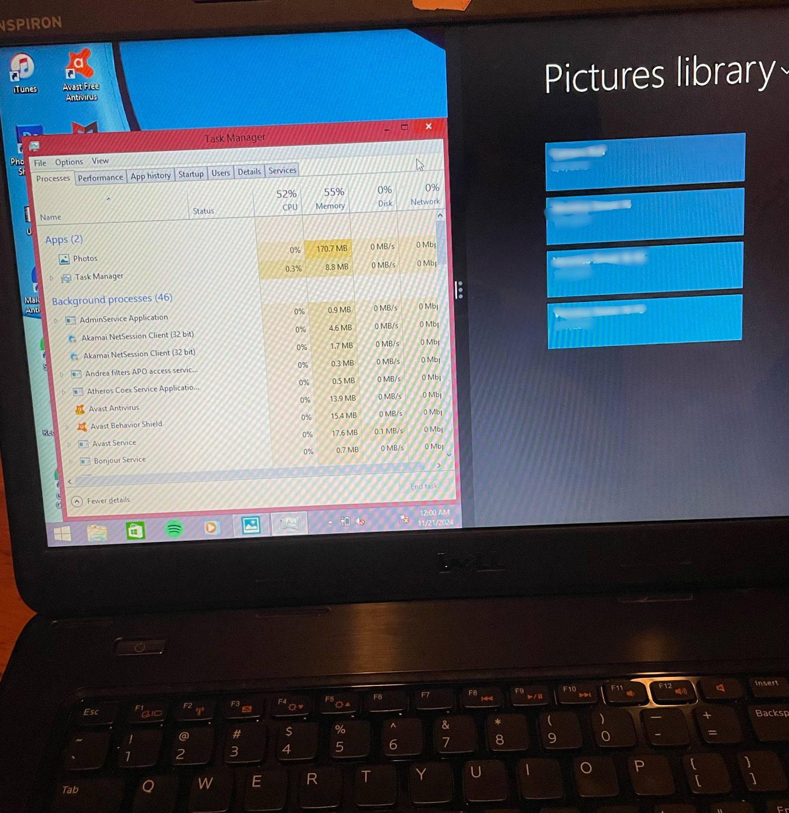
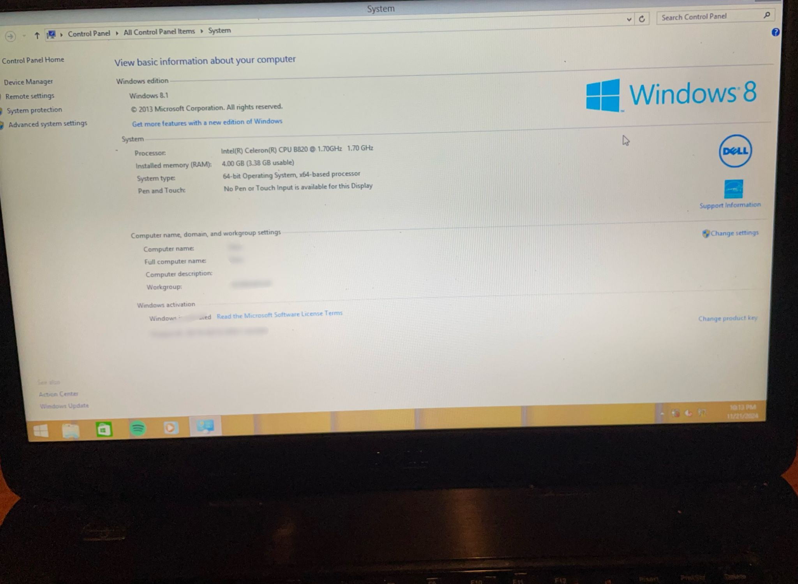
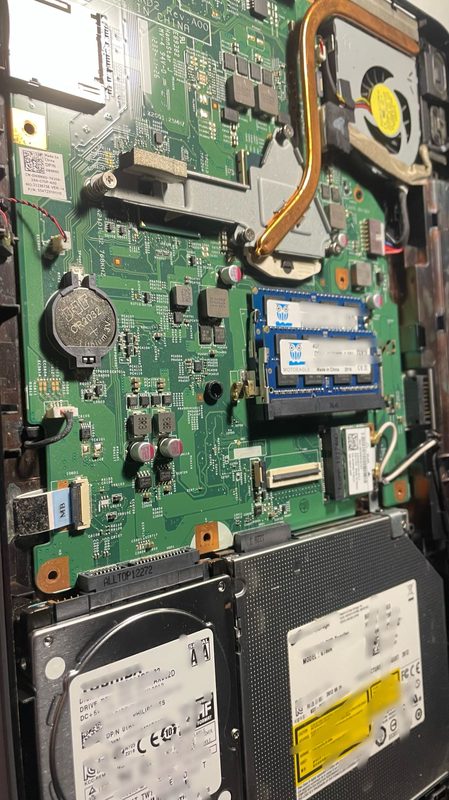
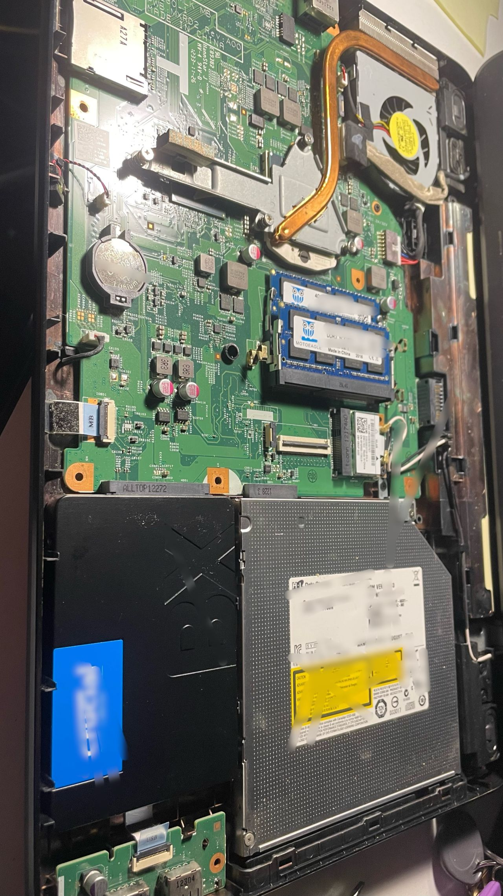
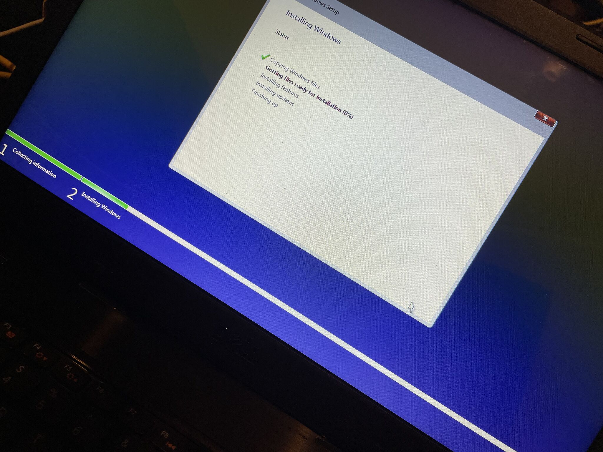
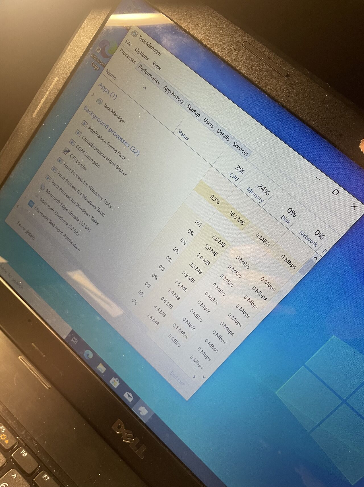
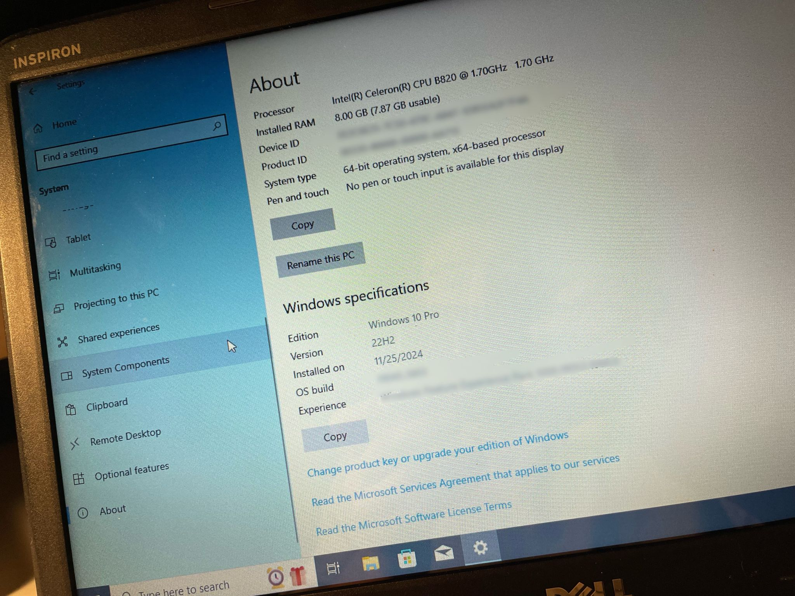

# reviving-laptop-performance
Revived a slow, aging Dell laptop by performing a full hardware and software restoration. Upgraded RAM, replaced HDD with an SSD, reapplied thermal paste, removed bloatware, restored critical user data, and installed a clean modern OS, resulting in dramatic speed and reliability improvements.

## **Project Overview**
The laptop originally suffered from severe bloatware. The mouse lagged, memory usage was maxed out, and the system was borderline unusable. After recovering the user's important files, I performed a full hardware and software restoration:
- Applied fresh thermal paste to the CPU and heat sink
- Upgraded the RAM for better multitasking
- Replaced the slow mechanical HDD with a fast SSD
- Clean-installed Windows for performance and stability
- Removed bloatware and unnecessary startup services
- Verified system temperature, performance, and boot reliability
The final result was a dramatically faster, cooler, and fully functional system.

## **Key Activities Completed**

- Recovered important photos and user data before upgrades
- Removed failing components and cleaned the internal system
- Reapplied thermal paste to eliminate thermal throttling
- Upgraded RAM to improve multitasking performance
- Replaced HDD with SSD for fast boot and improved reliability
- Installed clean, up-to-date Windows OS
- Validated performance improvements after optimization
- Tuned system for lower memory usage and stable operation

## **Screenshots**

### **1. High Memory & CPU Usage Before Repair**
Shows the laptops original performance issues. The high memory usage, sluggish response, and heavy background processes caused by bloatware and outdated software. This confirmed that the system needed both software cleanup and hardware upgrades.

### **2. System Information Before Upgrade**
Displays the laptops original specs: low RAM, aging CPU, and Windows 8.1. The limited hardware and outdated OS contributed significantly to the slow performance and instability.

### **3. Internal Components Before Cleaning**
The laptop's opened chassis shows dust buildup, aging components, and the original hard drive. This step documented the device's physical condition before repairs began. Prior to this picture there was teo green colord RAM sticks of 2GB each.

### **4. Thermal Paste Removal & Fan Assembly**
The CPU and heatsink are shown with old, dried thermal paste removed. Thermal degradation was causing overheating and throttling. This step reduced temperatures and restored performance.

### **5. Upgraded RAM and SSD Installation**
This shows the installation of the new RAM modules and SSD. These upgrades replaced slow, outdated hardware and significantly improved boot times and system responsiveness.

### **6. Clean Windows Installation**
Windows installation and system rebuild in progress. This step eliminated corrupted files, bloatware, and legacy software that made the system unusable.

### **7. Performance After Optimization**
Task Manager displays after cleanup and upgrades. Memory usage is drastically lower, system responsiveness is restored, and CPU usage stabilizes. This confirms successful optimization.

### **8. Final System Specs After Upgrade**
The laptop now runs Windows 10 with upgraded RAM and SSD. This verifies the final configuration and confirms successful deployment of the new operating system.

## **Tools & Techniques**
- **Hardware Repair & Upgrades**
    - Thermal paste application
    - RAM upgrade
    - HDD to SSD migration
    - Internal cleaning and dust removal
- **System Optimization**
    - Clean Windows installation
    - Removing bloatware
    - Startup optimization
    - Driver updates
- **Data Recovery**
    - Restoring photos and user documents
    - Verifying integrity after migration
- **Troubleshooting**
    - Thermal throttling diagnosis
    - Performance bottleneck analysis
    - Legacy hardware compatibility

## **Purpose**
The purpose of this project was to rescue an aging laptop that had become nearly unusable. By combining hardware upgrades, thermal repair, and a full OS refresh, the system was restored to a stable and responsive state. This extended its lifespan and improved the performance dramatically.
